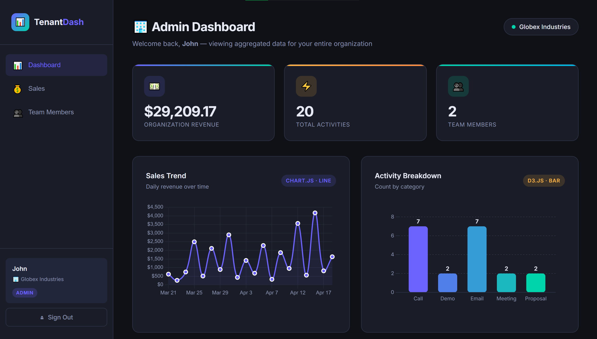

# TenantDash (Multi-Tenant Dashboard Web App)

A full-stack multi-tenant dashboard with role-based access control, built with **Flask + React + Supabase**.

---

## Dashboard Preview
 

 
> **Admin view**; aggregated organization revenue, activity breakdown by category (D3.js bar chart), and sales trend over time (Chart.js line chart). The dashboard dynamically switches between admin and user views based on the logged-in user's role.
 
---

## Tech Stack

| Layer      | Technology                          |
|------------|-------------------------------------|
| Backend    | Python / Flask                      |
| Frontend   | React.js + CSS                      |
| Line Chart | Chart.js (via react-chartjs-2)      |
| Bar Chart  | D3.js                               |
| Auth + DB  | Supabase (Auth + PostgreSQL + RLS)  |

---

## Architecture Overview

```
Browser (React)
    │
    │  HTTP + Bearer JWT
    ▼
Flask Backend  ──► Supabase (service role key — bypasses RLS for server-side enforcement)
    │
    │  JWT verified server-side (PyJWT)
    │  org_id + role extracted from DB (not trusted from client)
    │  All queries filtered by org_id and role IN PYTHON
    ▼
Supabase PostgreSQL (RLS as second layer of defense)
```

### Why Two Layers of Security?
1. **Flask middleware** verifies the Supabase JWT and fetches `org_id` + `role` from the DB on every request. All SQL queries are explicitly scoped to the user's org.
2. **Supabase RLS policies** act as a second firewall; even if the backend were bypassed, the DB would still refuse cross-org queries.

---

## Step 1 — Supabase Project Setup

### 1.1 Create a Supabase Project
1. Go to [https://supabase.com](https://supabase.com) and create a free account
2. Click **New Project**, name it (e.g. `tenant-dashboard`), set a database password
3. Wait for the project to be provisioned (~1 minute)

### 1.2 Run the SQL Schema
1. In your Supabase dashboard → **SQL Editor** → **New Query**
2. Paste the entire contents of `supabase_setup.sql`
3. Click **Run**; this creates tables, RLS policies, indexes, and a seed function

### 1.3 Collect Your Credentials
From your Supabase project → ** Project Settings → API **:

| Credential | Where to find it |
|---|---|
| `SUPABASE_URL` | Project URL (e.g. `https://xyzxyz.supabase.co`) |
| `SUPABASE_ANON_KEY` | `anon` / `public` key |
| `SUPABASE_SERVICE_ROLE_KEY` | `service_role` key (keep secret!) |
| `SUPABASE_JWT_SECRET` | Settings → JWT Key → Legacy JWT Secret |

### 1.4 Disable Email Confirmation (for testing)
Supabase → **Authentication → Sign In / Providers → Supabase Auth** → turn off **"Confirm email"**
(Re-enable for production)

---

## Step 2 — Backend Setup

```bash
cd backend

# Create and fill in environment variables .env file
# Edit .env with your Supabase credentials + a random Flask secret key

# Create virtual environment
python -m venv venv

# Activate (Windows)
venv\Scripts\activate
# Activate (Mac/Linux)
source venv/bin/activate

# Install dependencies
pip install -r requirements.txt

# Run Flask server
python app.py
# → Running on http://localhost:5000
```
Your `.env` should look like:
```
SUPABASE_URL=https://your-project.supabase.co
SUPABASE_ANON_KEY=eyJhb...
SUPABASE_SERVICE_ROLE_KEY=eyJhb...
SUPABASE_JWT_SECRET=your-jwt-secret-from-supabase-settings
FLASK_SECRET_KEY=any-random-string-here
FLASK_ENV=development
```

---

## Step 3 — Frontend Setup

```bash
cd frontend

# Create environment variable .env file
# (Default REACT_APP_API_URL=http://localhost:5000/api is fine for local dev)

# Install dependencies
npm install

# Start React dev server
npm start
# → Opens http://localhost:3000
```

---

## Step 4 — Create Users & Seed Data

### 4.1 Sign Up Users via the App
1. Open http://localhost:3000
2. Click **"Create one"** to go to signup
3. Create at least 2 users for each organization:
   - e.g. `admin@acme.com` + `user@acme.com` for **Acme Corp**
   - e.g. `admin@globex.com` + `user@globex.com` for **Globex Industries**

### 4.2 Promote Admins
In Supabase → **SQL Editor**, run:
```sql
UPDATE public.profiles SET role = 'admin' WHERE email = 'admin@acme.com';
UPDATE public.profiles SET role = 'admin' WHERE email = 'admin@globex.com';
```

### 4.3 Seed Sample Data
In Supabase → **SQL Editor**, run:
```sql
SELECT seed_sample_data();
```
This inserts 10 sales + 10 activities for **every profile** in the DB, spread over the past 30 days.

---

## Step 5 — Test the App

| Login As | Expected Behavior |
|---|---|
| `admin@acme.com` | Sees ALL Acme Corp data, team members, aggregated charts |
| `user@acme.com` | Sees ONLY their own sales and activities |
| `admin@globex.com` | Sees ALL Globex data; NO Acme data visible |
| `user@globex.com` | Sees ONLY their own data within Globex |

---

## API Endpoints

### Auth
| Method | Endpoint | Auth | Description |
|---|---|---|---|
| GET | `/api/auth/organizations` | None | List orgs for signup |
| POST | `/api/auth/signup` | None | Register new user |
| POST | `/api/auth/login` | None | Login, returns JWT |

### Dashboard (all require Bearer token)
| Method | Endpoint | Admin | User |
|---|---|---|---|
| GET | `/api/dashboard/stats` | Org-wide totals | Personal totals |
| GET | `/api/dashboard/sales-trend` | All org sales by date | Own sales by date |
| GET | `/api/dashboard/activity-breakdown` | Org activity categories | Own categories |
| GET | `/api/dashboard/recent-sales` | All org recent sales | Own recent sales |

### Users (require Bearer token)
| Method | Endpoint | Auth | Description |
|---|---|---|---|
| GET | `/api/users/me` | Any | Current user profile |
| GET | `/api/users/org-members` | Admin only | List all org members |

---

## Project Structure

```
dashboard-app/
├── backend/
│   ├── app.py                  # Flask app factory
│   ├── middleware.py           # JWT verification + role extraction
│   ├── supabase_client.py      # Supabase client helpers
│   ├── requirements.txt
│   ├── .env
│   └── routes/
│       ├── auth.py             # Signup, login, org list
│       ├── dashboard.py        # Stats, charts, tables
│       └── users.py            # Profile, members
│
├── frontend/
│   ├── public/index.html
│   ├── package.json
│   ├── .env
│   └── src/
│       ├── App.js              # Router + layout
│       ├── index.js
│       ├── index.css           # All styles
│       ├── context/
│       │   └── AuthContext.js  # Global auth state
│       ├── hooks/
│       │   └── useDashboardData.js
│       ├── utils/
│       │   └── api.js          # Axios instance + interceptors
│       ├── pages/
│       │   ├── LoginPage.js
│       │   ├── SignupPage.js
│       │   └── DashboardPage.js
│       └── components/
│           ├── Sidebar.js
│           ├── StatCard.js
│           ├── SalesTrendChart.js   # Chart.js line chart
│           ├── ActivityBarChart.js  # D3.js bar chart
│           ├── RecentSalesTable.js
│           └── MembersTable.js
│
└── supabase_setup.sql          # Schema + RLS + seed function
```

---

## Key Implementation Details

### Multi-Tenancy
Every query to `sales` and `activities` **always** includes `.eq('organization_id', org_id)` where `org_id` comes from the server-verified JWT; never from the client request body.

### Role-Based Access
`role` is fetched from the `profiles` table on the server using the service-role key. The client cannot inject or spoof it. Admin routes use the `@admin_required` decorator which checks `g.role`.

### Chart Libraries
- **Chart.js** (via `react-chartjs-2`): Used for the Sales Trend line chart. Declarative React API, responsive canvas.
- **D3.js**: Used for the Activity Breakdown bar chart. Full manual DOM control via `useRef` + `useEffect`, with animated bars and interactive tooltips.
